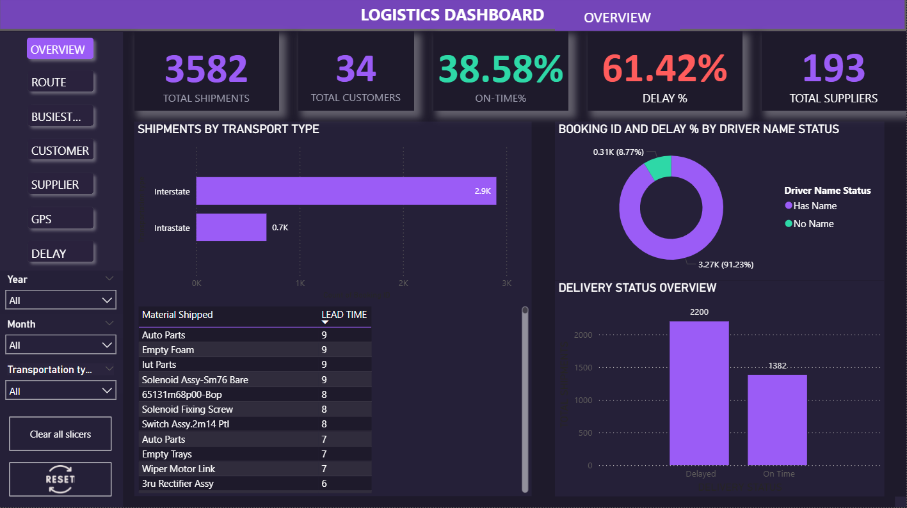

# Muhammed Midlaj E V
**Data Analyst | Supply Chain and Operations Analytics**  
Dubai, United Arab Emirates  
Available for immediate interviews  

---

## About Me
I am a Data Analyst with hands-on experience in supply chain, inventory control, retail operations, and logistics analytics. I analyse operational and business data using SQL, Power BI, Tableau, Microsoft Excel, and Google Sheets to improve reporting accuracy, operational visibility, and decision-making. I have worked in real business environments across retail and logistics functions and am currently available in Dubai for on-site opportunities.

---

## Featured Project

### Logistics Shipment Performance and Delay Analysis
**Tools:** Power BI Desktop, Microsoft Excel  

**Business Context**  
Logistics operations require clear visibility into shipment delays, route performance, and delivery efficiency. This project analysed shipment data to identify delay patterns and operational inefficiencies affecting delivery performance.

**Work Performed**
- Analysed shipment routes, delivery timelines, distances, and delay data
- Identified delay-prone routes and suppliers using structured analysis
- Designed dashboards in Power BI Desktop and Tableau to track key performance indicators
- Evaluated on-time versus delayed deliveries across transport modes
- Applied data cleaning and validation techniques to improve reporting accuracy

**Outcome**
- Improved visibility of shipment and delivery performance
- Supported data-driven route planning and operational review
- Enabled identification of high-delay areas for corrective action

Note: This image shows a live walkthrough of the Power BI dashboard, explaining shipment performance insights.

[View Dashboard Summary on LinkedIn](https://www.linkedin.com/posts/midlaj-e-v_dataanalysis-transport-supplynetwork-activity-7409472421747032064-Fteh?utm_source=social_share_send&utm_medium=member_desktop_web&rcm=ACoAADyOhdYBY-cOWpCu1WQXieU9dgSjbzoBzS0)

Note: The dashboard was developed using Power BI Desktop. Interactive walkthrough can be demonstrated during interviews.

---

## Operations Analytics Experience

### Multi-Branch Retail Reporting – Towersmart Supermarket (Dubai)
**Tools:** Google Sheets, Microsoft Excel, iTrade ERP  

**Context**  
Handled operational and financial reporting for four supermarket branches in Dubai.

**Work Performed**
- Designed and maintained a Google Sheets-based multi-branch reporting system
- Consolidated income, expenses, and salary data across four branches
- Enabled branch-level comparison and operational monitoring
- Improved reporting accuracy and management visibility

---

## Professional Experience

### Data Analyst Intern — Rows & Columns
- Analysed datasets exceeding 20,000 records using SQL and Excel
- Developed dashboards using Power BI Desktop and Tableau
- Automated recurring analytical reports, reducing manual reporting effort by 30 percent
- Improved reporting accuracy through structured data validation

---

### Accountant and Inventory Control — Towersmart Supermarket, Dubai
- Analysed inventory and sales data using ERP software and Excel
- Improved stock accuracy to 98 percent through structured reconciliation
- Reduced product waste and expiry losses by 50 percent
- Supported audit readiness through accurate financial and inventory records

---

### Business Development Executive — Road X Express Shipping
- Analysed shipping cost and route data across sea, air, and land transportation
- Generated analytical reports reducing logistics expenses by 15 percent
- Coordinated import and export documentation and carrier communication

---

## Tools and Skills
SQL, Power BI, Tableau, Microsoft Excel, Google Sheets, Data Analysis, Data Visualisation, Supply Chain Analytics, Inventory Analysis, Logistics Reporting

---

## Education
**Master of Business Administration – Logistics and Supply Chain Management**  
Pondicherry University  

**Bachelor of Commerce – Finance and Taxation**  
Mahatma Gandhi University  

---

## Contact
Email: midlaj.ev@gmail.com  
LinkedIn: https://www.linkedin.com/in/midlaj-e-v  

